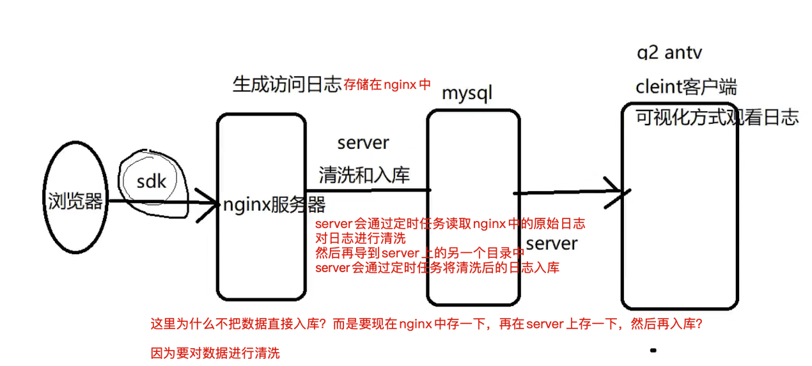

# 为什么需要前端监控
* 更快发现问题和解决问题（用户反馈之前自行解决了，比用户更早的发现问题）
* 为产品的决策提供依据(PV UV)
* 为业务扩展提供更多可能性（促销、增值服务）
* 提升前端工程师的技术深度和广度

# 前端监控的目标
监控的目标其实就是一些衡量指标，其中最重要的就是衡量用户体验或者说性能指标
想看更多的性能指标，可以看Chrome浏览器的`Lighthouse`或者[`webVitals`](https://web.dev/articles/vitals)

## 错误/异常监控指标
> **稳定性(stability)指标**
> 这些指标用于捕获和跟踪应用程序中的错误和异常
> 保证页面加载正常，不要出错

指标|示意|备注
---|---|---
白屏|页面空白，这个也是表象|没有现成的技术或者说监听事件，需要自行实现，利用Mutation Observer
内存溢出|网页死循环、卡死，这些都是表象|-
js错误/js执行异常|js执行错误|-
异步处理异常|promise/generator/async await异常|-
资源加载异常|script/link/img/font等资源加载异常|-
接口错误/网络异常|ajax或fetch请求接口异常|-
崩溃率|应用程序或页面在用户设备上崩溃的频率|-
‌第三方服务错误‌|集成第三方服务（如地图、支付网关）时出现的错误|-


## 性能监控指标
> 保证页面加载快，不会出现卡顿，交互灵敏
>
> 这些指标帮助评估应用程序的加载和运行速度、响应时间和资源利用情况

指标|备注
---|---
‌资源加载时间|各个资源（如JavaScript、CSS、img等）的加载时间
TTFB(time to first byte,首字节时间)|是指浏览器发起第一个请求到数据返回第一个字节所消耗的时间，这个时间包含了网络请求
FP(first paint,首次绘制/首屏渲染)|首次绘制包括了任何用户自定义的背景绘制，它是将第一个像素点绘制到屏幕的时刻
FCP(first content paint,首次内容绘制/首次内容渲染)|首次内容绘制是浏览器第一个DOM渲染到屏幕的时间，可以是任何文本、图像、SVG等的时间
FMP(first meaningful paint,首次有意义绘制)|首次有意义绘制是页面可用性的度量标准，视团队而定
FID(first input delay,首次输入延迟)|用户首次和页面交互到页面响应交互的时间
LCP|最大内容渲染|页面上最大内容元素渲染完成的时间
CLS|布局偏移|需要借助Mutation Observer
LT/PLT(Load Time/Page Load Time,页面完全加载时间)|页面及其所有资源（图像、脚本、CSS等）完全加载的时间
卡顿|超过50ms的长任务

## 用户体验监控指标

**用户行为指标**

指标|示意
---|---
PV(Page Views)|页面浏览量
UV(Unique Visitors)| 指访问某个站点的不同ip地址的人数,唯一访客数
Sessions|会话数
BR(Bounce Rate)|跳出率
ASD(Average Session Duration)|平均会话时长

**用户互动指标**

指标|示意
---|---
CTR(Click-Through Rate)|点击率
Form Submission Rate|表单提交率
Conversion Rate|转化率
User Retention Rate|用户留存率
User Feedback|用户反馈
页面停留时间|用户在每一个页面的停留时间

**页面滚动和视图指标**

指标|示意
---|---
Scroll Depth|页面滚动深度
Page View Percentage|页面视图比例
Element Visibility|元素可见性

## 资源使用监控指标
> 这些指标关注应用程序对系统资源的消耗情况

指标|示意
---|---
‌内存使用（Memory Usage）‌|Web应用程序占用的内存量
‌CPU使用率（CPU Usage）‌|Web应用程序消耗的CPU资源
‌网络使用量（Network Usage）‌|发送和接收的数据量

## ‌安全性/合规性监控指标‌
> 用于监控和检测潜在的安全威胁

指标|示意
---|---
‌XSS攻击检测‌|检测跨站脚本攻击
‌CSRF攻击检测‌|检测跨站请求伪造攻击
‌安全漏洞扫描‌|定期扫描前端代码中的已知安全漏洞

## 自定义业务指标
> 根据具体业务需求定义的指标

指标|示意
---|---
‌购物车转化率‌|将商品添加到购物车并最终购买的用户比例

# 前端监控系统设计流程


## 埋点

**埋点的意义**

通过埋点来采集和上报用户行为的方式进行实现。

**常见的埋点方案**

* **代码埋点/手动埋点**
  * 代码埋点，就是以侵入代码的形式进行埋点，比如需要监控用户的点击时间，会选择在用户点击时，插入一段代码，保存这个监听行为或者直接将监听行为以某一种数据格式直接传递给服务器端
  * 有点是可以在任意时刻，精确地发送或保存所需要的数据信息
  * 缺点是工作量较大

* **可视化埋点**
  * 通过可视化交互的手段，代替代码埋点
  * 将业务代码和埋点代码分离，提供一个可视化交互的页面，输入为业务代码，通过这个可视化系统，可以在业务代码中自定义的增加埋点事件等等，最后输出的代码耦合了业务代码和埋点代码
  * 可视化埋点其实是用系统来代替手工插入埋点代码
  * 缺点：dom发生变化采集不到数据了

* **无痕埋点**
  * 前端的任意一个事件都被绑定一个标识，所有的事件都被记录下来
  * 通过定期上传记录文件，配合文件分析，解析出来我们需要的数据，并生成可视化报告供专业人员分析
  * 无痕埋点的优点是采集全量数据，不会出现漏埋和误埋等现象
  * 缺点是给数据传输和服务器增加了压力，所有的操作都会上报（事件冒泡，eventPhase来处理）也无法灵活定制数据结构

## 数据采集的技术手段
指标名称|主要技术|备注
---|---|---
稳定性指标|事件监听|error、unhandledrejection
性能指标|window.navigator.performance|-
业务指标|-|-

## 数据上报的技术手段
* img.gif，动态创建 img，src为上报地址（完美避开跨域问题）
* fetch
* window.navigator.sendBeacon()

## 整体流程
- 数据采集：开发前端监控sdk，使用sdk进行数据采集
- 数据上报：sdk会主动将数据进行上报，其实就是发送一个请求
- 服务层：nodejs\java\nginx\go\python、微服务架构microservice
- 消息队列：`kafka(topic)`、rabbitmq、rocketmq
  
  常见的数据库根本扛不住，因为单位时间内数据量很大，mysql、mongodb都扛不住
  扛不住怎么办？我们一般都会在服务层和数据入库中间嫁接一层，这一层叫做消息队列
- 实时数据加工、清洗、处理：`Flink`、spark、storm
- 数据入库：hbase、es、`clickhouse`、druid、hadoop、CDH、StarRocks
- 数据查询：clickhouse
- 可视化：Kibana(只能使用es数据源)、grafana、echarts、d3、highcharts
# 编写监控采集脚本
## 开通日志服务
## 监控错误
## 监控接口
**数据设计**

```js
{
  title: '', // 标题
  url: '', // 网页url
  timestamp: '', // 时间戳
  userAgent: '',
  kind: 'stability',
  type: 'xhr',
  eventType: 'load',
  pathname: '', // api请求路径
  status: '200-OK'， // http状态码
  duration: '',
  response: '', // 响应内容
  params: '' // 请求参数
}

{
  title: '', // 标题
  url: '', // 网页url
  timestamp: '', // 时间戳
  userAgent: '',
  kind: 'stability',
  type: 'xhr',
  eventType: 'load',
  pathname: '', // api请求路径
  status: '500-Internal Server Error'， // http状态码
  duration: '',
  response: '', // 响应内容
  params: '' // 请求参数
}
```

# 白屏
白屏就是页面上什么都没有

**数据设计**
```js
{
  title: '前端监控系统',
  url: 'http://locahost:8080',
  timestamp: 144530405005,
  userAgent: 'chrome',
  kind: 'stability', // 大类
  type: 'blank', // 小类
  emptyPoints: 0, // 空白点
  screen: '2049*1152', // 分辨率
  viewPoint: '2048*994', // 视口
  selector: 'HTML BODY #container' // 选择器
}
```

**技术方案**
* `window.screen`: 返回当前window的screen对象，返回当前渲染窗口中和屏幕有关的属性
* `window.innerWidth`: 只读的window属性innerWidth返回以像素为单位的窗口的内部宽度
* `window.innerHeight`: 窗后的内部高度（布局视口）的高度
* layout_viewport
* `document.elementsFromPoint()`: 方法可以获取到当前视口内制定坐标处，由里到外排列的所有元素




server有几方面的作用：
1. 与nginx打配合，nginx负责处理日志的上报
2. 与redis打配合，定时读取mysql中的监控数，缓存到redis中，当到达告警配置的阈值时，进行告警
3. 处理业务逻辑和业务api请求


